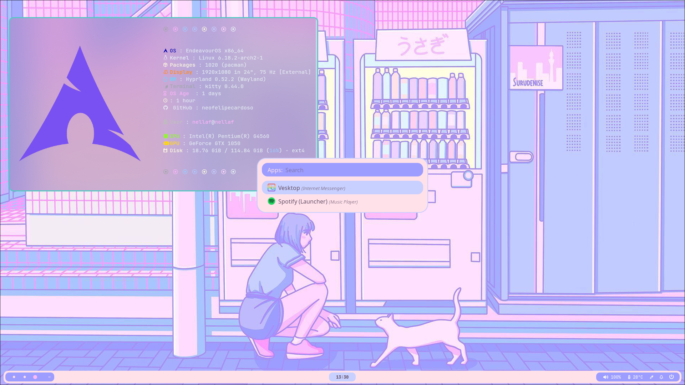

# Dotfiles



A collection of my **Linux dotfiles**, focused on a **clean pastel aesthetic**, minimalism, and a smooth Wayland workflow.

---

## ✨ Overview

* **OS**: Arch Linux
* **Display Server**: Wayland
* **Compositor**: Hyprland
* **Terminal**: Kitty
* **Shell**: Zsh
* **Theme**: Pastel / Soft colors


* visually calm 
* lightweight 

---

## 🚀 Usage

Clone the repository:

```bash
git clone git@github.com:neofelipecardoso/dotfiles.git
cd dotfiles
```

Apply configurations manually or using your own sync script.

---

## 🧠 Notes

* This repo is **personal**, but feel free to take inspiration.
* Some configs may assume Arch-based systems.

---

## 📸 Screenshot

The screenshot above shows the current desktop setup and overall theme direction.

---

## 📜 License

MIT — use it however you like.
